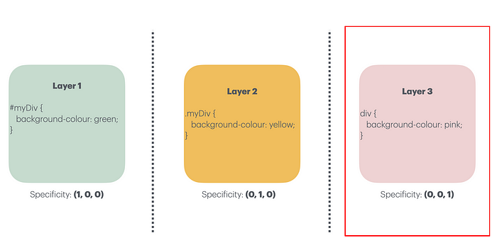
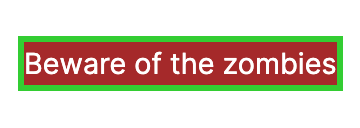
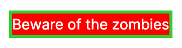
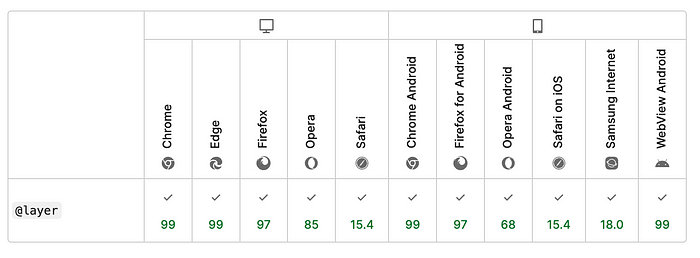

+++
title = "Intro to CSS Cascade Layers"
publishDate = 2024-05-06T00:00:00+07:35
lastmod = 2024-05-28T11:24:47+05:45
tags = ["css"]
categories = ["frontend", "UI"]
draft = true
featuredImage = "assets/tailwind-wizard.jpg"
featuredImagePreview = "./posts/tailwind-best-practises/assets/tailwind-surfer.jpg"
+++

Imagine having a sandwich. Sandwich has different ingredients stacked on top of each other as a layer. Lettuce, tomato, patty, sauces, cheese. Each ingredient is important to the sandwich as a whole and changes it's flavour as and when it gets added. The precedence of the ingredient that is added at the top takes over all the other ingredient. So, as a consumer of the sandwich, you'll get the taste of cheese, sauces, patty, tomato and then lettuce.

CSS Cascade Layers is the same. Each CSS Layer has a certain specificity applicable for an element selector. If there is a layer that appears after a specific layer, it overrides the specificity of the selector in previous element even if the previous layer had a selector on the same element with higher specificity. Have a look at below diagram to understand which CSS style would be applicable when there are 3 layers.

Image explaining which layer styles are applicable

In the above image, there are 3 layers stacked on top of each other. Layer 1 appears first and Layer 3 appears at the very end of cascade. In reference to the sandwich analogy, Layer 1 is at the bottom of the sandwich (lettuce) and Layer 3 is at the top (cheese). Here, despite Layer 1 and Layer 2 having higher specificity selectors for the div element, the final styles that are applicable are that of Layer 3 despite it having the lowest specificity. It works on the principle of **Cascading.**

CSS Layer can be defined using `@layer` in the CSS files. In case of multiple cascade layers in a single file, the `@layer` can be used to define the order of the layer priorities `@layer base, utilities, component`. This states that `base` has the lowest priority and `component` has the highest priority. The order in which styles that would be applied to elements in HTML would be first from `base`, then `utilities` and `component`. Have a look at below code:

**HTML**

    
Beware of the zombies

**CSS**

    @layer base, utilities;

    @layer utilities {
      .alert {
        background-color: brown;
      }
      p {
        border: medium solid limegreen;
      }
    }

    @layer base {
      .alert {
        border: medium solid violet;
        background-color: yellow;
        color: white;
      }
    }

**Output**

Output of above code

In the above code, we can see that the order of priority is defined clearly. The highest priority is for `utilities` as it comes at the very end in the list of layers on the first line. Following this, the styles can be defined inside of a layer using below format:

    @layer LAYER_NAME {
    // your style rules here
    }

    @layer LAYER_NAME {
    // your style rules here
    }

Layers can be defined in any sequence as the developer has already defined the priority in which layers should be applied to elements at the very top of the file.

Styles rules within a cascade layer get applied together. This gives more fine grained control to cascading in CSS to the developer.

#### Anonymous Cascade Layers

Any style rules that is outside of a layer gets bundled into an **anonymous layer** and this anonymous layer has the highest priority over and above all the defined layers. For e.g.

    @layer base, utilities;

    @layer utilities {
      .alert {
        background-color: brown;
      }
      p {
        border: medium solid limegreen;
      }
    }

    @layer base {
      .alert {
        border: medium solid violet;
        background-color: yellow;
        color: white;
      }
    }

    .alert {
      background-color: red;
    }

In the above case, the output would be as shown below:

Output of styles outside of layers

Once they order of layer has been established, the specificity and the order of appearance are ignored. This feature of CSS Cascade Layers enables developers to create simpler selectors. Developers no longer need to find hacks and cheats where specificity needs to be overridden.

Anonymous cascade layers can be created by creating a layer but not assigning a name:

    @layer {
      p {
        margin-block: 1rem;
      }
    }

#### Importing style rules as layer

Developers can import other CSS module files and assign them to a layer. For e.g.

    @import "theme.css" layer(utilities);

Here, in the above example, the contents or style rules of `theme.css` file get assigned to `utilities` layer.

#### Nesting layers

Layers can be nested using below format:

    @layer framework {
      @layer layout {
      }
    }

New style rules can be added to `layout` layer by using the following format, i.e. adding `.` in between the parent and child layer:

    @layer framework.layout {
      p {
        margin-block: 1rem;
      }
    }

#### Browser compatibility

Browser compatibility is great for `@layer` and this feature is widely used now a days.

Browser compatibility for @layer

I hope this article was useful. Please consider sharing this articles with your CSS friends or friends who are into Web Development. Please subscribe to my Medium blog and also like this articles. Mention use cases of `@layer` in the comment section.

### In Plain English 🚀

_Thank you for being a part of the_ _[**In Plain English**](https://plainenglish.io/)_ _community! Before you go:_

*   Be sure to **clap** and **follow** the writer ️👏**️️**
*   Follow us: **[X](https://twitter.com/inPlainEngHQ)** **|** **[LinkedIn](https://www.linkedin.com/company/inplainenglish/)** **|** **[YouTube](https://www.youtube.com/channel/UCtipWUghju290NWcn8jhyAw)** **|** **[Discord](https://discord.gg/in-plain-english-709094664682340443)** **|** **[Newsletter](https://newsletter.plainenglish.io/)**
*   Visit our other platforms: [**Stackademic**](https://stackademic.com/) **|** [**CoFeed**](https://cofeed.app/) **|** [**Venture**](https://venturemagazine.net/) **|** [**Cubed**](https://blog.cubed.run/)
*   More content at **[PlainEnglish.io](https://plainenglish.io/)**