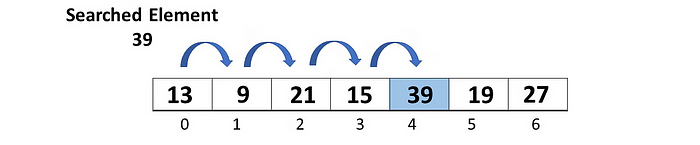
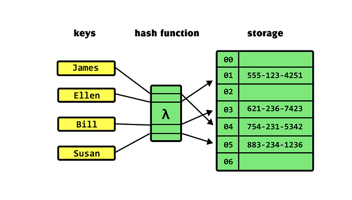

+++
title = "Stop Using Find Method in JavaScript"
publishDate = 2022-07-03T00:00:00+05:45
lastmod = 2022-07-20T11:24:47+05:45
tags = ["tailwind", "css"]
categories = ["UI", "UX"]
draft = false
featuredImage = "images/c296f1e6ff165e57d2b7f7484876711ef0ca963b.jpeg"
featuredImagePreview = "./posts/js-map-vs-array/images/c296f1e6ff165e57d2b7f7484876711ef0ca963b.jpeg"
+++

First of all, we can say that the **Map** data structure, which many of us know but rarely or perhaps never use, is not as insignificant as it seems. In this article, we will focus on certain fundamental topics and clarify the purpose of the Map and when it can be useful to us.

What is Big O Notation?
-----------------------

Understanding Big O Notation is crucial for analyzing the efficiency and scalability of algorithms and data structures. It allows developers to assess how algorithms will perform as the size of the input data increases. The notation provides a standardized way to express the worst-case scenario of an algorithm’s runtime in relation to the size of the input. As developers, it’s essential to choose algorithms and data structures with favorable time complexities to ensure efficient performance, especially when dealing with large datasets.

When considering all this data, it becomes apparent that it’s best for the methods we use not to be dependent on the size of ’n’ data. While these operations may be fast enough to go unnoticed individually, combining multiple operations simultaneously or nested loops can significantly degrade the user experience.

How does the find() method work?
--------------------------------

As we all know, the `find()` method in JavaScript performs a linear search on an array. It returns the first element that satisfies the given condition, and it reads through all the data until it finds that element. Therefore, considering the worst-case scenario, where the item we are searching for is the last element of the array, we say it has a time complexity of O(n). This situation is exemplified in Aditya Bhargava's book "Grokking Algorithms" as follows:

Let’s imagine ourselves as new employees in a market, and we’re trying to find the prices of the products customers are buying from the list of products we have. We repeat this process for each product from start to finish. Doesn’t sound like a very practical work experience, does it? Now, envision having a more experienced colleague who knows all the prices by heart and can directly tell you the prices for each product. Sounds great, doesn’t it? In fact, our experienced colleague who knows everything and returns all the prices with a time complexity of O(1), meaning constant time independent of the number of products, is our hash map. So let’s take a closer look at hash maps.

What is a hash map and how fast is it?
--------------------------------------

A hash map is essentially a storage that can map keys to their corresponding values. When you provide it with a key, it returns the value associated with that key, and you can perform insertion and deletion operations using the same key value in these hash tables. So, it’s a very fast storage system and requires O(1) time complexity for all these operations.

However, there are some points to be aware of; for example, keys distributed with a poor hash function can collide, making it difficult when we want to perform searches. Or having a hash table with a fill rate of more than about 70% can also lead to performance losses.

When and why the use of a Map is superior to that of an Array?
--------------------------------------------------------------

In a project, we often use the find() method more in user interactive components. For example, situations where we need to fetch data based on params in dynamic routes, manipulate a specific piece of data, or retrieve data selected from a dropdown or entered into an input field are instances where we require methods like find and sometimes filter. All of these operations work linearly and have a time complexity of O(n). Let’s take a look at how easy it is to accomplish all of these tasks with a Map.

What is Map?
------------

The Map in JavaScript provides a data structure for mapping keys to values. Unlike arrays, which are indexed by a range of numbers, maps can use **any value** as a key. This flexibility makes maps useful in various scenarios, especially when dealing with complex data structures or when **quick access to data** is required.

let hashData = null;
const getUsers = async () => {
  try {
    const response = await fetch("https://dummyjson.com/users");
    const data = await response.json();
    hashData = new Map(data.users.map((user) => \[user.username, user\]));

  } catch (error) {
    console.error("Hata:", error);
  }
};

To convert our data into a Map using this method and to ensure that our keys are unique, we need to iterate over our data once. The only point we need to pay attention to is that our keys must be **unique**. Then we have the following result;

This way, instead of using `find`, we can access the value associated with a key in our Map data structure using `get` with a time complexity of O(1), independent of the size of the data. Moreover, using the `has` method, we can check for the existence of that data with a time complexity of O(1) instead of using `includes` with a time complexity of O(n). Keys are case-sensitive, which provides us with convenience.

> Methods of the Map data-structure

