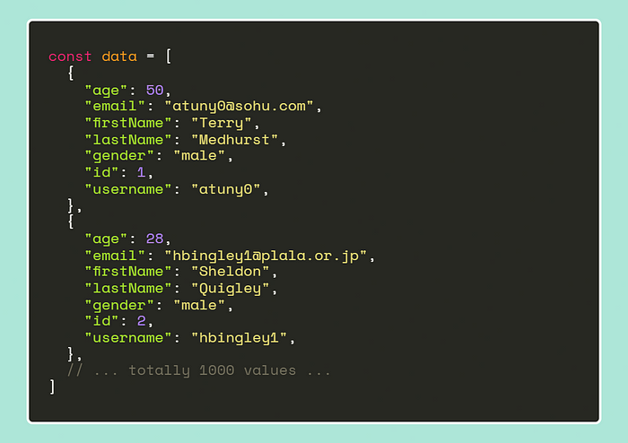
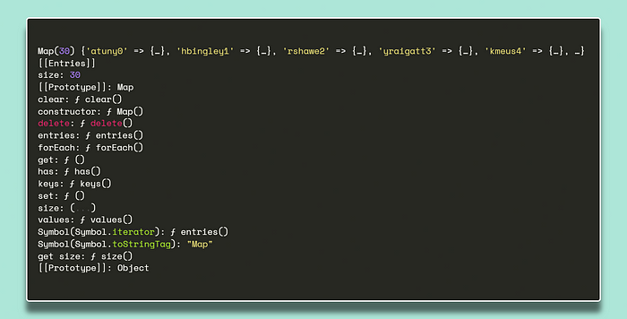
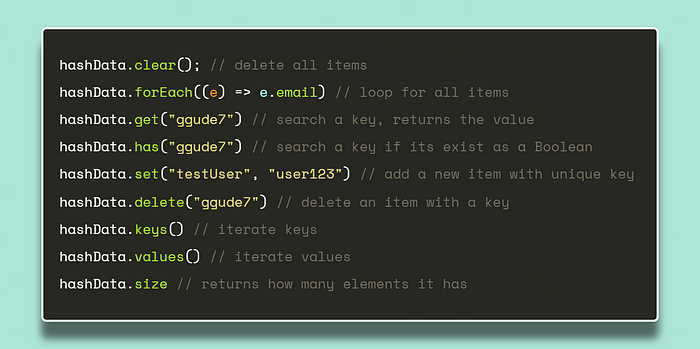

+++
title = "ES6 Maps are very underrated!"
publishDate = 2024-04-21T00:00:00+05:45
lastmod = 2024-04-22T11:24:47+05:45
tags = ["reactjs", "javascript","algorithms"]
categories = ["algorithms", "frontend"]
draft = false
featuredImage = "images/maps-vs-array-feature-image.jpg"
featuredImagePreview = "./posts/js-map-vs-array/images/maps-vs-array-feature-image-preview.jpg"
+++

Javascript `Map` is a recently introduced data structure, hence it is not as widely understood as it would first appear, also is not as little as it first appears. We will start off with some fundamentals in this post and gradually head towards explaining the `Map`'s function as well as certain situations in which it may be helpful.

The Big :o: Notation
-----------------------

Understanding Big O Notation is crucial for analyzing the efficiency and scalability of algorithms and data structures. It allows developers to assess how algorithms will perform as the size of the input data increases. The notation provides a standardized way to express the worst-case scenario of an algorithm’s runtime in relation to the size of the input. As developers, it’s essential to choose algorithms and data structures with favorable time complexities to ensure efficient performance, especially when dealing with large datasets.

When considering all this data, it becomes apparent that it’s best for the methods we use not to be dependent on the size of ’n’ data. While these operations may be fast enough to go unnoticed individually, combining multiple operations simultaneously or nested loops can significantly degrade the user experience.


Imagine you're a chef. **Big O Notation** is like a recipe that tells you how much more time you'll need if you decide to cook for a banquet instead of a family dinner. It's a way to measure the ***"heaviness"*** of a recipe. Just like you'd want a dish that can be scaled up easily for a large crowd, in programming, you want algorithms that can handle growing amounts of data gracefully. So, Big O is like a heads-up: 

> *"Hey, this recipe might take a bit longer if you add more guests,"* 



[`Array.prototype.find()`](https://developer.mozilla.org/en-US/docs/Web/JavaScript/Reference/Global_Objects/Array/find)
--------------------------------

The `find()` method in JavaScript performs a linear search on an array. It returns the first element that satisfies the given condition, and it reads through all the data until it finds that element. Therefore, considering the worst-case scenario, where the item we are searching for is the last element of the array, we say it has a time complexity of `O(n)`. This situation is exemplified in Aditya Bhargava's book [Grokking Algorithms](https://www.manning.com/books/grokking-algorithms) as follows:




You’re in a huge library filled with books, and you’re tasked with finding specific information. Without a system, you’d have to look through each book one by one, which is time-consuming and inefficient, especially if the library keeps getting more books.

Now, imagine you have a magical index that instantly points you to the exact location of the information you need, no matter how many books are in the library. This magical index is like a hash map in programming. It doesn’t matter if you have 10 books or 10,000; the magical index (hash map) helps you find your information quickly every time, which is why we say it has a time complexity of O(1)—it’s always fast, regardless of the size of the library (or data). 📚✨


Hash Map :world_map:
--------------------------------------

A hash map is essentially a storage that can map keys to their corresponding values. When you provide it with a key, it returns the value associated with that key, and you can perform insertion and deletion operations using the same key value in these hash tables. So, it’s a very fast storage system and requires `O(1)` time complexity for all these operations.



However, there are some points to be aware of; for example, keys distributed with a poor hash function can collide, making it difficult when we want to perform searches. Or having a hash table with a fill rate of more than about 70% can also lead to performance losses.

When and why the use of a Map is superior to that of an Array?
--------------------------------------------------------------

In a project, we often use the find() method more in user interactive components. For example, situations where we need to fetch data based on params in dynamic routes, manipulate a specific piece of data, or retrieve data selected from a dropdown or entered into an input field are instances where we require methods like find and sometimes filter. All of these operations work linearly and have a time complexity of O(n). Let’s take a look at how easy it is to accomplish all of these tasks with a Map.

What is Map?
------------

The Map in JavaScript provides a data structure for mapping keys to values. Unlike arrays, which are indexed by a range of numbers, maps can use **any value** as a key. This flexibility makes maps useful in various scenarios, especially when dealing with complex data structures or when **quick access to data** is required.

let hashData = null;
const getUsers = async () => {
  try {
    const response = await fetch("https://dummyjson.com/users");
    const data = await response.json();
    hashData = new Map(data.users.map((user) => \[user.username, user\]));

  } catch (error) {
    console.error("Hata:", error);
  }
};

To convert our data into a Map using this method and to ensure that our keys are unique, we need to iterate over our data once. The only point we need to pay attention to is that our keys must be **unique**. Then we have the following result;

This way, instead of using `find`, we can access the value associated with a key in our Map data structure using `get` with a time complexity of O(1), independent of the size of the data. Moreover, using the `has` method, we can check for the existence of that data with a time complexity of O(1) instead of using `includes` with a time complexity of O(n). Keys are case-sensitive, which provides us with convenience.

> Methods of the Map data-structure

