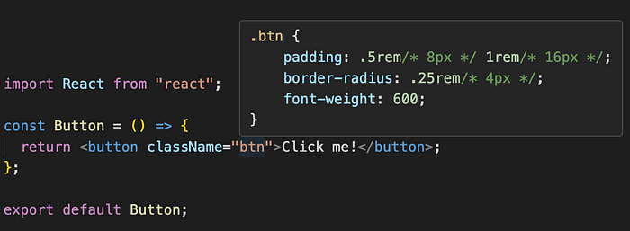

+++
title = "How to TailWind CSS like a Pro"
publishDate = 2024-04-23T00:00:00+05:45
lastmod = 2024-04-23T11:24:47+05:45
tags = ["tailwind", "reactjs"]
categories = ["frontend", "UI"]
draft = false
featuredImage = "assets/tailwind-wizard.jpg"
featuredImagePreview = "./posts/tailwind-best-practises/assets/tailwind-surfer.jpg"
+++

In this article, I’ll share some best practices for working with Tailwind CSS, which I usually prefer to abide by and have learnt over a period of time.

By following these tips, you can keep your application clean, organized, and maintainable, even as your project grows.

1\. Do not repeat same class names for elements
-----------------------------------------------

Prefer to create separate components which have uniform styles throughout the application instead of rewriting the same class names at multiple places or creating a new class name which includes all the tailwind class names using `@apply` directive.

Doing so would offer us the flexibility of updating our styles with minimal efforts, as we have to update the class names at a single place only.

Suppose we have a `h1` tag which will be used at multiple places. We have two approaches to achieve it:

1.  We can create a component `H1Heading` with tailwind classes applied to it and reuse this component wherever required.

2\. We can create a class in our CSS file which includes all the tailwind class names for the particular element and use the class name wherever required.

2\. Maintain organized style guide using design tokens
------------------------------------------------------

Design tokens are a way to store and manage your design variables, such as colour palette, spacing scale, typography scale, or breakpoints. With design tokens, you can create consistent and reusable styles that are easy to update and maintain.

You can create the design tokens in the `tailwind.config.js` file. This is a good way to centralize your design tokens and make them available to all of your Tailwind CSS classes.

Suppose our application follows a particular design system, we can add these guidelines to our tailwind configuration:

3\. Avoid using arbitrary values
--------------------------------

Imagine our web application follows some colour scheme where we have `#7743DB` as our theme colour and `#0D0D0D` as our background colour.

We can add these colours to our tailwind configuration and refer to them using class names, such as `bg-background` `text-theme` instead of using arbitrary values at multiple places, i.e. `bg-[#0D0D0D]` or `text-[#7743DB]`.

Now, if we want to change our application's colour scheme, we just need to update our tailwind configuration instead of renaming the arbitrary class names at multiple places.

4\. Avoid applying dynamically generated class names
----------------------------------------------------

You all might have encountered this issue while working with dynamic classes that whenever we apply some dynamic class name based on state or some condition, the class name appears in elements panel on the browser, but its corresponding CSS does not.

This is because Tailwind scans your source code for classes using regular expressions to extract every string that could possibly be a class name. He nce, any broken class name string such as `border-[${borderColor}]` would not be recognised by tailwind at build time, and it would not be included in the output CSS file of tailwind.

Suppose, we have to change the border colour of our element based on the colour code passed in props. There are two ways to it:

1.  Defining a separate class name for each state value. This is only applicable if you know all the expected values of the `borderColor` at build time.

> Note: `clsx` is utility package for constructing `className` strings conditionally.

2\. If we do not know all the expected value of `borderColor` at build time, it is better to pass the border colour in the style attribute of the element to support unknown values.

5\. Creating utility to read Tailwind Configuration in JavaScript
-----------------------------------------------------------------

In web applications, rarely a situation arises where you need to read some CSS design token value in JavaScript, but when it does, we generally hardcode the CSS design token value in our code while working with tailwind. This is not a good practise as in future if you changed your design token value in your tailwind configuration, your code might still refer to the older value which can cause unwanted behaviour.

Hence, we can build a custom utility function to read the tailwind configuration in our code:

6\. Defining Tailwind Plugins to register new/complex CSS styles
----------------------------------------------------------------

Tailwind provides us with plugins to register new styles to inject into the user’s stylesheet using JavaScript instead of writing custom CSS styling in stylesheets.

I find this approach better, as writing custom CSS classes means you're essentially rewriting CSS and waving goodbye to Tailwind’s organized workflow and simple maintenance.

Suppose we want to create a `.btn` class which has several styles attached to it. This is how we can achieve it:

This is how the `.btn` class would look like when you hover over it:

Tailwind supports registering complex styles as well, along with user provided values. You can go through the tailwind official documentation for plugin ([link](https://tailwindcss.com/docs/plugins#overview)) to know more about it.

I have tried to explain the practices with the best example that I know. If you know others, share in the comments for everyone!