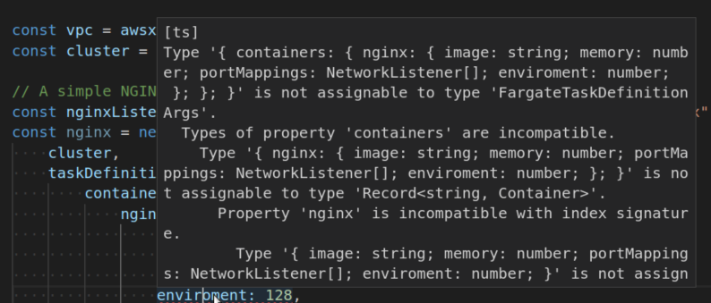

+++
title = "Trying GoLang for the first time"
publishDate = 2024-06-01T00:00:00+01:15
lastmod = 2024-06-03T11:24:47+05:45
tags = ["golang", "typescript"]
categories = ["languages", "programming"]
draft = false
featuredImage = "images/golang-exciting.jpeg"
featuredImagePreview = "./posts/ts-dev-tries-go/images/trying-golang.jpeg"
+++

As someone who has been involved in software development for over 3 years, I have primarily worked with JavaScript -*and nowadays Typescript mostly*- although I have also used languages like Python for specific projects. In this article, I want to share my initial impressions of the Go programming language as a web developer. I don't intend for this to be a negative critique of JavaScript, as there are already plenty of those. Instead, I will highlight a few aspects of Go that I find particularly interesting and cool.

Explicit error handling 💉
--------------------

In JavaScript development, it is often the case that we return errors as regular JavaScript objects instead of throwing instances of the built-in `Error` class. The act of throwing should only be used when intentionally crashing the program. This is because JavaScript is [single-threaded and synchronous](https://groovetechnology.com/blog/why-javascript-is-single-threaded/), so throwing an error will stop the execution of the program. This can be problematic in some cases, especially when working with asynchronous code. Additionally, JavaScript has a built-in `try...catch` statement that can be used to catch errors and handle them gracefully.


    try {
      throw new Error('This is an error');
    } catch (error) {
      console.error(error.message);
    }


In Go, [error handling](https://go.dev/blog/error-handling-and-go) is built-in and follows a different approach. Errors are returned as values, and they are explicitly handled using `if err != nil` checks. If a program needs to crash, the `panic` keyword can be used. Additionally, Go provides the `recover` statement to recover from a panic. Although writing error handling code in this manner may seem complex, it greatly enhances readability, which is a valuable trade-off in my opinion.

The `defer` statment: A simple way to handle cleanup tasks
-----

The defer statement in Go allows you to postpone the execution of a function until the surrounding function finishes. Let's take a look at an example where I open a file to copy its contents to another file:


    func CopyFile(dstName, srcName string) (written int64, err error) {
        src, err := os.Open(srcName)
        if err != nil {
            return
        }
        dst, err := os.Create(dstName)
        if err != nil {
            return
        }
        written, err = io.Copy(dst, src)
        dst.Close()
        src.Close()
        return
    }



If the call to `os.Create` fails, the function will return without closing the src file. This can be easily fixed by adding a call to `src.Close` before the second return statement, but if the function were more complex the problem might not be so easily noticed and resolved. By introducing defer statements we can ensure that the files are always closed:



    func CopyFile(dstName, srcName string) (written int64, err error) {
        src, err := os.Open(srcName)
        if err != nil {
            return
        }
        defer src.Close()

        dst, err := os.Create(dstName)
        if err != nil {
            return
        }
        defer dst.Close()

        return io.Copy(dst, src)
    }


Defer statements allow us to think about closing each file right after opening it, guaranteeing that, regardless of the number of return statements in the function, the files will be closed.

This example is inspired from an excellent article: [defer, panic, and recover](https://go.dev/blog/defer-panic-and-recover) by Andrew Gerrand. It’s a fantastic read and it expands on the rules of `defer` and how it works in tandem with other unique control flow statements like `panic` and `recover`.

Type conversion is explicit
---------------------------
One of the main subjects of memes in JavaScript is its ridiculous type coercion. JavaScript attempts to automatically convert the types of values based on the operation being performed. Although type coercion can be useful in certain situations, it frequently results in bugs and confusion for beginners.



**In Go**, explicit type conversion is required when assigning values between different types. Attempting to assign a `string` to an `int` or perform operations between mismatched types will result in a compilation error. Although this may add some complexity to writing Go code, it greatly enhances code readability and maintainability, which is a common characteristic of the language.

No break statement needed at the end of every switch case
---------------------------------------------------------

Here’s a JavaScript switch statement from MDN:

    const expr = 'Papayas';
    switch (expr) {
      case 'Oranges':
        console.log('Oranges are $0.59 a pound.');
        break;
      case 'Mangoes':
      case 'Papayas':
        console.log('Mangoes and papayas are $2.79 a pound.');
        break;
      default:
        console.log(`Sorry, we are out of ${expr}.`);
    }

Here is the same switch written in Go:

    expr := "Papayas"
    switch expr {
    case "Oranges":
    	fmt.Println("Oranges are $0.59 a pound.")
    case "Mangoes", "Papayas":
    	fmt.Println("Mangoes and papayas are $2.79 a pound.")
    default:
    	fmt.Printf("Sorry, we are out of %s.", expr)
    }

Go’s switch is like the one in C, Java, JavaScript, and PHP, except that Go only runs the selected case, not all the cases that follow. In effect, the break statement that is needed at the end of each case in those languages is provided automatically in Go.

Pointers
--------

In Go, function arguments are all passed by value or copied by default. This includes things like arrays and structs. You can explicitly define a function that takes a pointer as an argument. A pointer holds the memory address of a value. Here’s a snippet from the official Go tutorial:

    func main() {
    	i, j := 42, 2701

    	p := &i         // point to i
    	fmt.Println(*p) // read i through the pointer
    	*p = 21         // set i through the pointer
    	fmt.Println(i)  // see the new value of i

    	p = &j         // point to j
    	*p = *p / 37   // divide j through the pointer
    	fmt.Println(j) // see the new value of j
    }

Again, this makes Golang so easy to read and maintain.

Basic type system
------------------

Don’t get me wrong, I love TypeScript. I can’t imagine myself going back to the dark times of having to `console.log` everything just to get to know what I’m working with. But the type system might be a little too rich for my taste. I often run into situations where I have to do a lot of type gymnastics when I’m using it. This is especially true when building libraries. A complex type system also leads to very complicated, sometimes unhelpful error messages: 

In contrast, Go possesses a straightforward type system. You have the usual primitives like int, string, … etc. You have arrays, slices, and structs. You have interfaces and functions. Generics were later added to the language. That’s it. The compiler is very fast and will display very concise/helpful error messages most of the time.

Only one way to do things
-------------------------

While it may sound restrictive at first, the fact that Go offers only one approach to each task makes it a simple language to work with. Especially for big teams working on big codebases. A junior developer should produce the same code a senior would produce working on the same problem. A simple example for that is loops in Go.

Go has only one looping construct, the `for` loop.

    sum := 0
    for i := 0; i < 10; i++ {
    	sum += i
    }
    fmt.Println(sum)

The init and post statements are optional. You can drop the semicolons making `for` a while loop in Go:

    sum := 1
    for sum < 1000 {
    	sum += sum
    }
    fmt.Println(sum)

If you omit the loop condition it loops forever, so an infinite loop is compactly expressed.

    for {
    	// runs forever
    }

Still ways to go
----------------

I just started learning Go. The only way I can describe it is that **Go is Simple**. So incredibly simple. When you read a program written in Go you almost always know what it does. The icing on that cake is that Go’s performance is so good. It’s sometimes hard to believe that Go is a garbage-collected programming language. It’s been used to build performance critical software such as the [cockroach database](https://github.com/cockroachdb/cockroach) and many others.

This is just the beginning for me. I’ll write more about Go as I get more experienced in it. I’m excited to see what I can build using this beautifully simple language. Wish me luck 🍀